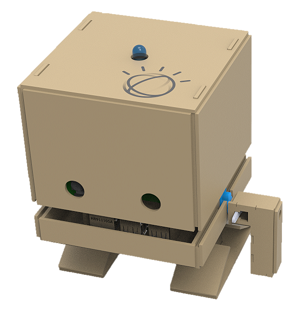

  

  

# 
 IBM Watson TJBOT DIY project 

This repository was created as part of my **“Building Robots with TJBot”** study to get the IBM related badge. I have tried to capture all initial configuration steps and code created during the study labs.

### Related github repositories and links:

* https://www.research.ibm.com/tjbot/

* https://ibmtjbot.github.io/

* https://github.com/ibmtjbot/tjbot

* https://my-tjbot.mybluemix.net/

* https://github.com/ibmtjbot/tjbotlib
